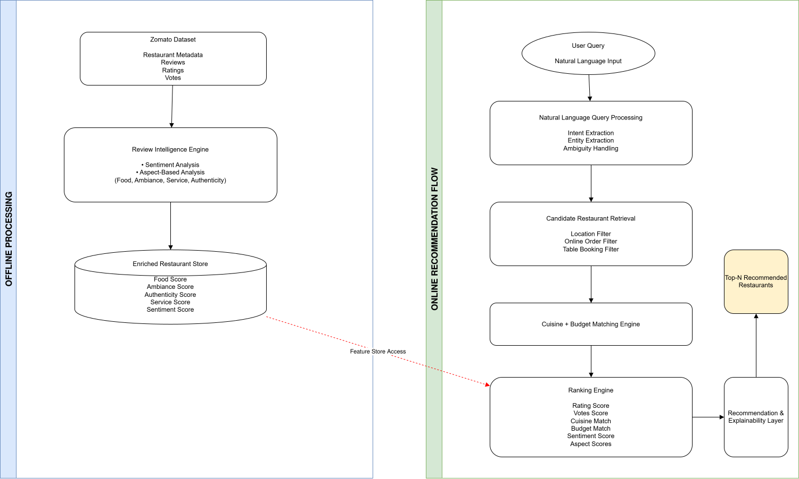

# NLP-Based Restaurant Recommendation System

An end-to-end NLP-powered restaurant recommendation system built using restaurant metadata, customer reviews, sentiment analysis, aspect-based scoring, OpenAI-powered query understanding, candidate retrieval, ranking, and explainable recommendations.

The system transforms raw restaurant and review data into intelligent recommendations that can understand natural language queries such as:

> Find me a cozy cafe in Indiranagar under ₹1000 with great ambiance and online ordering.

and return personalized restaurant recommendations with explainable reasons.

---

## Architecture



The system follows a two-lane architecture:

### Offline Processing Lane

Builds restaurant intelligence features from raw Zomato restaurant and review data.

### Online Recommendation Lane

Processes natural language user queries and generates personalized recommendations in real time.

---

## Features

### Data Processing

* Restaurant data cleaning and standardization
* Missing value imputation
* Location normalization
* Cuisine normalization
* Cost and rating preprocessing

### Review Intelligence Pipeline

* Review extraction
* Review text cleaning
* Sentiment analysis using VADER
* Review count generation
* Popularity scoring
* Aspect-based scoring

Generated restaurant features:

* Food Score
* Ambiance Score
* Service Score
* Authenticity Score
* Value for Money Score
* Sentiment Score
* Popularity Score

### Natural Language Understanding

OpenAI-powered query parsing converts natural language into structured filters.

Example:

#### User Query

```text
Find me an authentic South Indian restaurant in Jayanagar under ₹1000 with online ordering
```

#### Parsed Filters

```json
{
  "location": "Jayanagar",
  "cuisine": "South Indian",
  "budget": 1000,
  "online_order": true,
  "book_table": true
}
```

### Recommendation Engine

* Candidate Retrieval
* Intent Analysis
* Weighted Ranking
* Confidence Scoring
* Explainable Recommendations

---

## Offline Processing Pipeline

```text
Raw Zomato Dataset
        │
        ▼
Data Cleaning & Standardization
        │
        ▼
Review Extraction & Cleaning
        │
        ▼
Sentiment Analysis
        │
        ▼
Aspect Score Generation
        │
        ▼
Popularity Scoring
        │
        ▼
Enriched Restaurant Dataset
```

Outputs:

```text
data/processed/restaurants_cleaned.csv
data/processed/restaurants_enriched.csv
```

---

## Online Recommendation Pipeline

```text
User Query
        │
        ▼
OpenAI Query Parser
        │
        ▼
Intent Analysis
        │
        ▼
Candidate Retrieval
        │
        ▼
Ranking Engine
        │
        ▼
Explainability Layer
        │
        ▼
Restaurant Recommendations
```

---

## Project Structure

```text
api/
├── main.py
├── routes.py
└── schemas.py

src/
├── config/
├── data/
├── scoring/
├── nlp/
├── retrieval/
├── ranking/
├── pipelines/
└── utils/

tests/
data/
docs/
```

---

## Installation

Clone the repository:

```bash
git clone <repository-url>
cd NLP_based_resturant_recomendation_system
```

Install dependencies:

```bash
pip install -r requirements.txt
```

Create a `.env` file:

```env
OPENAI_API_KEY=your_api_key
OPENAI_MODEL=gpt-4.1-mini
OPENAI_MAX_RETRIES=3
```

---

## Generate Processed Datasets

Run data cleaning:

```bash
python -m src.pipelines.data_cleaning_pipeline
```

Run restaurant scoring:

```bash
python -m src.pipelines.restaurant_scoring_pipeline
```

Generated outputs:

```text
data/processed/restaurants_cleaned.csv
data/processed/restaurants_enriched.csv
```

---

## Running the API

Start FastAPI:

```bash
uvicorn api.main:app --reload
```

Swagger Documentation:

```text
http://127.0.0.1:8000/docs
```

---

## Example Request

```http
POST /recommend
```

```json
{
  "query": "Find me a cozy cafe in Indiranagar under ₹1000 with great ambiance and online ordering",
  "top_n": 5
}
```

---

## Example Response

```json
{
  "recommendations": [
    {
      "name": "Smoor",
      "location": "Indiranagar",
      "rating": 4.6,
      "cost_for_two": 900,
      "online_order": true,
      "reasons": [
        "Highly rated by customers"
      ]
    }
  ]
}
```

---

## Testing

Run the test suite:

```bash
pytest
```

---

## Dataset

This project uses the publicly available Zomato Bangalore Restaurant Dataset.

The dataset contains:

* Restaurant metadata
* Ratings
* Votes
* Cost information
* Cuisine information
* Customer reviews

---

## Future Improvements

* Hybrid retrieval using embeddings
* Semantic restaurant search
* User preference learning
* Collaborative filtering
* Recommendation evaluation framework
* Personalized ranking
* React frontend with conversational search

---

## Tech Stack

* Python
* Pandas
* NumPy
* FastAPI
* OpenAI API
* NLTK (VADER)
* Pytest

---

## License

This project is licensed under the MIT License.

Copyright (c) 2026 Divya Rani

Permission is hereby granted, free of charge, to any person obtaining a copy
of this software and associated documentation files (the "Software"), to deal
in the Software without restriction, including without limitation the rights
to use, copy, modify, merge, publish, distribute, sublicense, and/or sell
copies of the Software, and to permit persons to whom the Software is
furnished to do so, subject to the following conditions:

The above copyright notice and this permission notice shall be included in all
copies or substantial portions of the Software.

THE SOFTWARE IS PROVIDED "AS IS", WITHOUT WARRANTY OF ANY KIND, EXPRESS OR
IMPLIED, INCLUDING BUT NOT LIMITED TO THE WARRANTIES OF MERCHANTABILITY,
FITNESS FOR A PARTICULAR PURPOSE AND NONINFRINGEMENT. IN NO EVENT SHALL THE
AUTHORS OR COPYRIGHT HOLDERS BE LIABLE FOR ANY CLAIM, DAMAGES OR OTHER
LIABILITY, WHETHER IN AN ACTION OF CONTRACT, TORT OR OTHERWISE, ARISING FROM,
OUT OF OR IN CONNECTION WITH THE SOFTWARE OR THE USE OR OTHER DEALINGS IN THE
SOFTWARE.